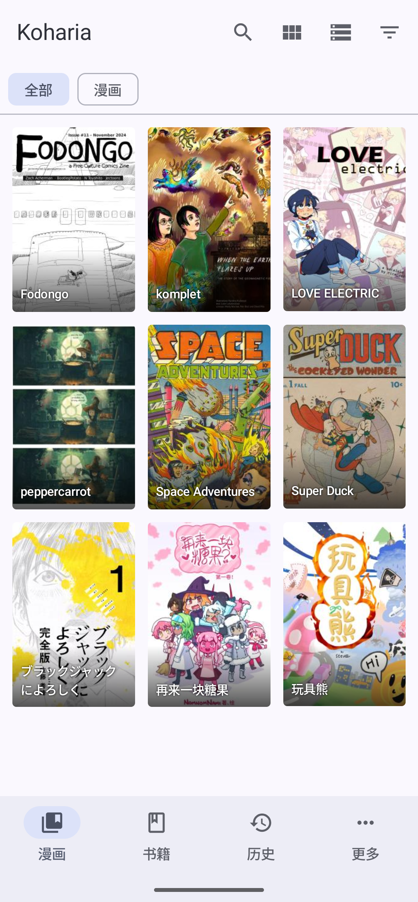
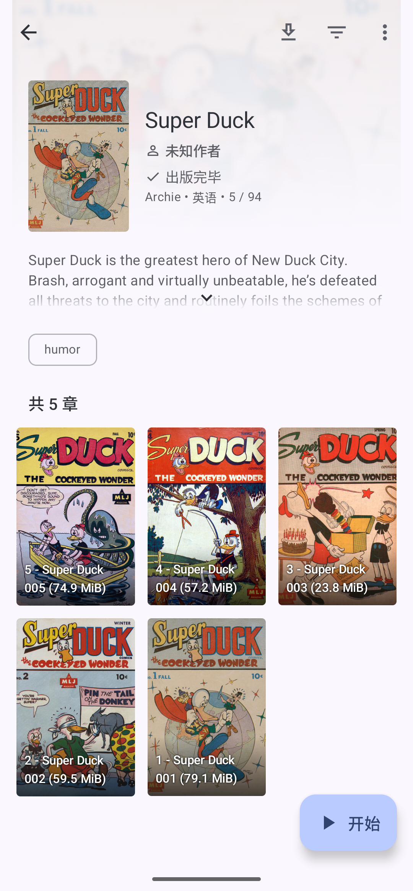
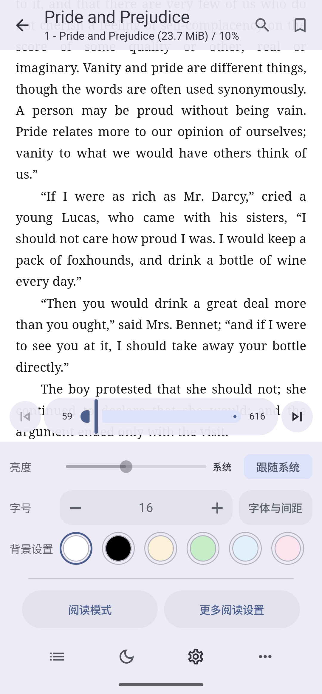

<div align="center">


<p><strong>简体中文</strong> · <a href="./README_EN.md">English</a></p>

# Koharia

同时支持漫画与 EPUB 书籍的 Android 阅读器

[](./LICENSE)
[](https://github.com/Mister-album/Koharia/releases/latest)

</div>

## 项目简介

Koharia 是一款面向 [Komga](https://komga.org/) 服务器的第三方 Android 客户端与阅读器，同时为漫画、扫描图像内容和可重排 EPUB 书籍提供专门的阅读体验。它将内容浏览、作品详情、阅读进度、离线访问与阅读设置整合在同一个应用中，让漫画和书籍可以按照各自更合适的方式展示和阅读。

项目基于 [Mihon](https://github.com/mihonapp/mihon) 的成熟 Android 阅读基础持续开发。Koharia 不提供或托管内容，你能浏览的作品取决于所连接的媒体库和账号权限。

<table>
  <tr>
    <td align="center" width="50%">
      <br/>
      <sub>主界面：分别浏览漫画与书籍</sub>
    </td>
    <td align="center" width="50%">
      <br/>
      <sub>作品详情：简介、章节与阅读入口</sub>
    </td>
  </tr>
  <tr>
    <td align="center" width="50%">
      <br/>
      <sub>漫画阅读：分页、进度与阅读方向</sub>
    </td>
    <td align="center" width="50%">
      <br/>
      <sub>书籍阅读：字体、间距、背景与排版</sub>
    </td>
  </tr>
</table>

## 适合谁使用

- 希望在同一个 Android 应用中阅读漫画与 EPUB 书籍。
- 拥有个人或家庭媒体库，需要封面浏览、作品详情、历史记录与进度同步。
- 重视阅读方向、字体排版、背景颜色、翻页方式和离线访问等个性化体验。
- 希望将手动下载、书籍缓存和漫画页面缓存分开管理。

Koharia 专注于个人媒体库阅读，不提供公共在线内容源，也不以恢复传统扩展生态为目标。

## 主要功能

### 漫画与书籍统一管理

- 可选择将媒体库划分为“漫画”和“书籍”，也可以保持合并书架。
- 支持封面网格、列表、搜索、筛选、排序、作品详情、阅读历史和多服务器快速切换。
- 服务器库分类与本地设置相互独立，便于按不同媒体库组织内容。

### 漫画阅读

- 支持分页、连续滚动、从左到右、从右到左及双页等阅读方式。
- 提供缩放、旋转、裁边、阅读方向、章节切换和进度拖动等常用控制。
- 优先加载当前页面，并根据阅读方向预取相邻页面，提升连续翻页体验。
- 支持单页缓存和手动下载，已缓存内容可在网络不稳定时继续阅读。

### EPUB 书籍阅读

- 使用原生 EPUB 阅读流程，支持分页、连续滚动及不同翻页方向。
- 可调整字号、字体、行距、段落间距、页边距、首行缩进和阅读区域。
- 支持自定义背景颜色、亮度、出版商样式、音量键翻页及刘海区域显示。
- 提供目录、书签、全文搜索、章节切换、阅读百分比与视觉页数显示。
- 排版变化后重新计算当前页与总页数，并缓存相同设备和排版设置下的分页结果。

### 进度、离线与数据管理

- 保存本地阅读位置、历史记录和书签，并与服务器同步支持的阅读进度。
- 手动下载、书籍缓存和漫画页面缓存使用独立策略，缓存不会被误标记为已下载内容。
- 支持缓存容量限制、按需资源读取、离线访问，以及按服务器组织下载目录。
- 支持多服务器配置、独立阅读设置、备份恢复和旧版本数据库迁移。

## 下载

| 渠道 | 下载地址 | 说明 |
| --- | --- | --- |
| GitHub Releases | [下载最新版本](https://github.com/Mister-album/Koharia/releases/latest) | 推荐，可查看完整版本说明与 APK Assets |
| 夸克网盘 | [打开下载链接](https://pan.quark.cn/s/f80624cde564?pwd=8tbp) | 提取码：`8tbp` |
| 百度网盘 | [打开下载链接](https://pan.baidu.com/s/1DlOuovGpIkaQh6NSo7b4cw?pwd=6s2g) | 提取码：`6s2g` |

安装前请确认下载的是项目发布的 APK。版本信息与更新说明以 GitHub Releases 为准。

## 构建项目

本项目面向 Android 8.0 及以上系统。推荐使用 Android Studio 打开项目，也可以在 Windows PowerShell 中使用 Gradle 构建。

常用验证命令：

```powershell
.\gradlew.bat spotlessCheck
.\gradlew.bat :app:compileDebugKotlin
```

生成发布包：

```powershell
.\gradlew.bat :app:assembleRelease
```

发布签名会读取本地的 `keystore.properties`。如果你只是本地开发或调试，通常不需要配置发布签名。

## 项目来源与声明

Koharia 基于 [Mihon](https://github.com/mihonapp/mihon) 开发，并遵循 Apache License 2.0。许可证与署名信息见 [LICENSE](./LICENSE) 和 [NOTICE](./NOTICE)。

贡献相关说明见 [CONTRIBUTING.md](./CONTRIBUTING.md) 与 [CODE_OF_CONDUCT.md](./CODE_OF_CONDUCT.md)。再分发或制作衍生版本时，请保留必要署名，并避免将其描述为 Mihon 或 Komga 的官方版本。

## 致谢

Koharia 建立在 Javier Tomas 最初完成的工作、Mihon 项目贡献者的持续投入，以及 Komga 社区提供的服务器生态之上。感谢所有继续改进这一衍生版本的贡献者。

## 支持

Koharia 是一个个人维护的开源项目。持续维护需要投入时间处理上游变更、阅读器体验、下载与同步、Android 版本兼容，以及日常测试和发布工作。

如果 Koharia 对你的阅读流程有帮助，欢迎通过爱发电支持项目。你的支持会直接帮助项目保持更新，并让我能更稳定地投入到修复问题和打磨漫画、书籍阅读体验中。

- 爱发电：[https://ifdian.net/a/album-Koharia](https://ifdian.net/a/album-Koharia)

## 免责声明

Koharia 不提供、不托管、不索引任何内容。应用只负责连接你配置的个人媒体服务器，并展示你有权访问的内容。请确保你对服务器中的内容拥有相应的使用权限，并遵守所在地法律法规。

## 许可证

Copyright (C) 2015 Javier Tomas

Copyright (C) Mihon contributors

Copyright (C) 2026 Koharia contributors

本项目基于 Apache License, Version 2.0 授权。详情见 [LICENSE](./LICENSE) 与 [NOTICE](./NOTICE)。
