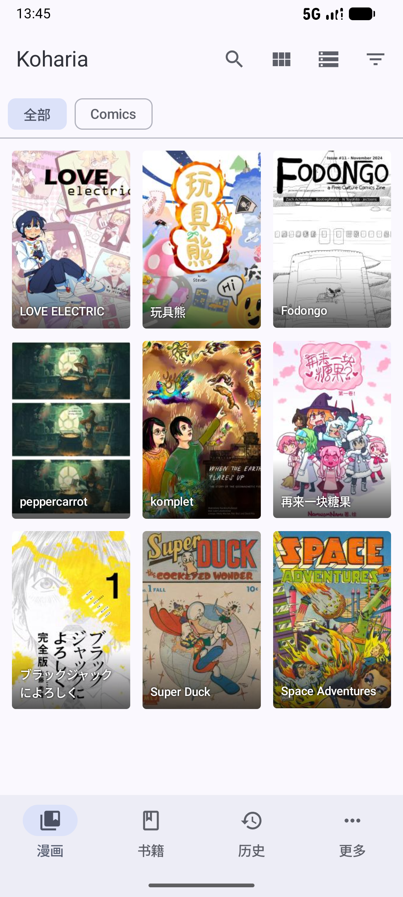
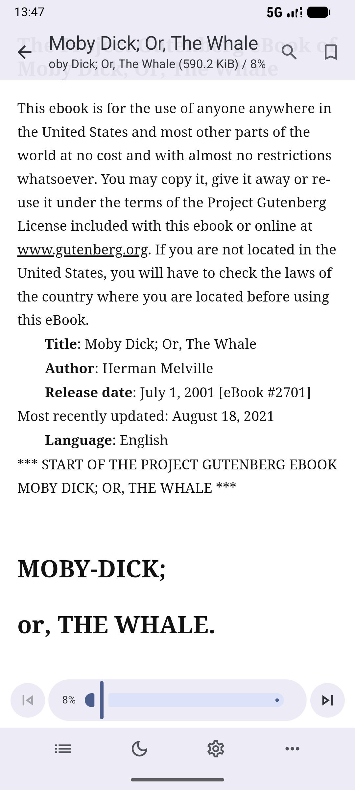
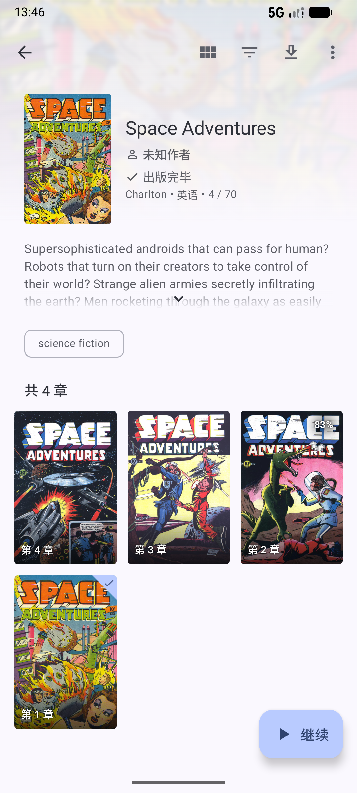
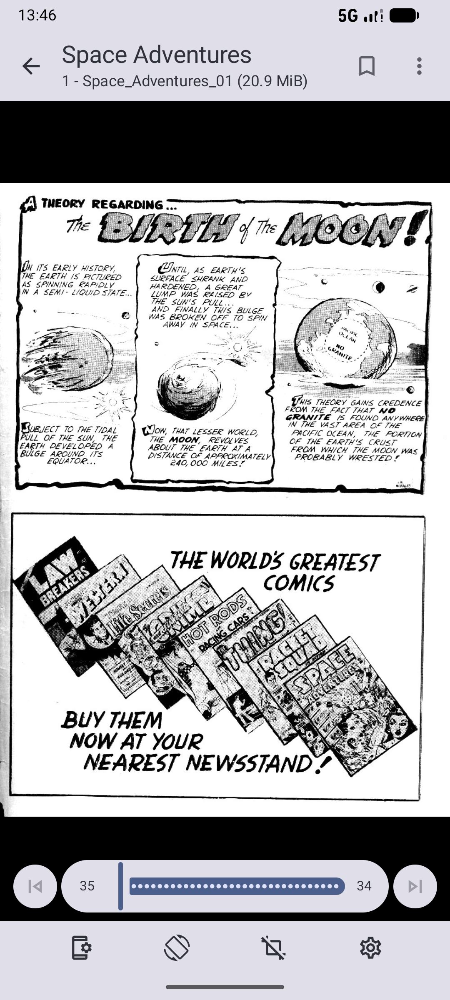

<div align="center">


<p><strong>简体中文</strong> · <a href="./README_EN.md">English</a></p>

# Koharia

面向 Komga、LANraragi 与本地媒体库的 Android 漫画和书籍阅读器

[](./LICENSE)
[](https://github.com/Mister-album/Koharia/releases/latest)

</div>

## 项目简介

Koharia 是一款面向 [Komga](https://komga.org/)、[LANraragi](https://github.com/Difegue/LANraragi) 服务器与本地媒体库的第三方 Android 客户端和阅读器。它为漫画、扫描图像内容、PDF 以及 EPUB、TXT、MOBI 等可重排书籍提供对应的阅读体验，并将内容浏览、作品详情、阅读进度、离线访问与阅读设置整合在同一个应用中。

项目基于 [Mihon](https://github.com/mihonapp/mihon) 的成熟 Android 阅读基础持续开发。Koharia 不提供或托管内容，你能浏览的作品取决于所连接的服务器、账号权限以及主动授权给应用的本地目录。

<table>
  <tr>
    <td align="center" width="25%">
      <br/>
      <sub>主界面</sub>
    </td>
    <td align="center" width="25%">
      <br/>
      <sub>书籍阅读</sub>
    </td>
    <td align="center" width="25%">
      <br/>
      <sub>作品详情</sub>
    </td>
    <td align="center" width="25%">
      <br/>
      <sub>漫画阅读</sub>
    </td>
  </tr>
</table>

## 适合谁使用

- 希望在同一个 Android 应用中阅读漫画、PDF 与多种电子书格式。
- 拥有个人或家庭媒体库，需要封面浏览、作品详情、历史记录与进度同步。
- 希望直接关联设备上的现有目录，或由应用创建并管理漫画与书籍目录。
- 重视阅读方向、字体排版、背景颜色、翻页方式和离线访问等个性化体验。
- 希望将手动下载、书籍缓存和漫画页面缓存分开管理。

Koharia 专注于个人媒体库阅读，不提供公共在线内容源，也不以恢复传统扩展生态为目标。

## 主要功能

### Komga 书库

- 内置 Komga 支持，可配置多个服务器与账号，并在书架中快速切换。
- 按服务器书库浏览系列与卷册，查看封面和作品详情，支持搜索、筛选与排序。
- 漫画使用分页、连续滚动或双页阅读；EPUB 使用可重排书籍阅读器。
- 支持在线阅读、手动下载和离线访问，并与服务器同步支持的阅读进度及历史记录。
- 书架数据缓存到本地，优先显示已有内容；可手动刷新，也可响应服务器更新事件。

### LANraragi 书库

- 内置 LANraragi 支持，无需安装扩展；可添加多个服务器，通过服务器地址与 API Key 配置连接，未启用鉴权时可留空 Key。
- Archive 作为独立作品阅读，Tankoubon 作为合集显示其 Archive 成员；Category 显示在书架顶部，方便切换分类。
- 支持搜索、标签与阅读状态筛选、排序，以及在线阅读和手动下载后离线阅读。
- Archive 可直接进入阅读器，也可先打开带逐页网格预览的详情页，再从指定页面开始阅读。
- 缓存书库元数据，离线时仍可浏览和搜索；正文需另行下载，元数据缓存不代表作品已下载。
- 按 Archive 同步阅读进度，离线阅读记录可在恢复连接后补传；需要服务器开启进度记录并提供相应权限。“标记未读”仅重置本地状态，不清零服务器进度。

### 本地媒体库

- 可通过 Android 系统目录授权关联已有文件夹，扫描过程不会移动或删除原文件；也可由 Koharia 创建 `Comics`、`Books` 与 `.koharia` 目录结构。
- 本地目录可标记为漫画、书籍或混合内容，并分别归入自定义书库。
- 提供“系列库”和“单文件库”两种组织方式：前者将一级文件夹视为系列，后者递归展示可直接阅读的文件和图片目录。
- 支持本地索引、下拉刷新、封面提取、格式筛选、条目详情编辑，以及从第一页生成封面。
- 可从 Android 文件打开或分享入口临时阅读支持的文件，也可将文件导入具备写入权限的本地目录。
- 统一使用扩展名、MIME 类型和文件特征识别格式，降低文件名缺失或扩展名不准确造成的导入失败。
- 元数据编辑结果可仅保存在应用数据库，也可写入作品旁的 `ComicInfo.xml` / `metadata.opf`，或本地库的 `.koharia/metadata` 统一目录。

#### 本地格式支持

| 内容类型 | 扩展名或形式 | 阅读方式与说明 |
| --- | --- | --- |
| 漫画压缩包 | `CBZ`、`ZIP`、`CBR`、`RAR`、`7Z`、`CB7`、`TAR`、`CBT` | 使用漫画阅读器，支持分页、连续滚动与双页等模式 |
| 图片与图片目录 | `JPG`、`JPEG`、`PNG`、`GIF`、`WEBP`、`AVIF`、`HEIF`、`HEIC`、`JXL` | 可作为单个条目或按目录组织阅读 |
| EPUB | `EPUB` | 使用原生可重排阅读器，支持目录、书签、搜索与排版设置 |
| PDF | `PDF` | 按页原生渲染，使用漫画分页或连续滚动阅读流程 |
| 纯文本 | `TXT` | 自动识别 UTF-8、UTF-16、GB18030 等常见编码，支持分页和书籍排版设置；单文件上限为 64 MiB |
| Mobipocket / Kindle | `MOBI`、`PRC`、`AZW`、`AZW3` | 实验性支持 PalmDOC / KF8 文本和基础元数据，使用可重排分页；暂不支持 DRM、复杂布局与内嵌图片，单文件上限为 256 MiB |
| DjVu | `DJVU`、`DJV` | 通过 MIT 许可的 `djvu-rs` WASM 解码 JB2 / IW44 页面并使用漫画阅读器显示；运行依赖 Android WebView 的 WebAssembly 能力 |

DJVU 解码器由系统 WebView 的 JavaScript / WebAssembly 运行时执行，当前构建不包含或使用 Chicory。组件来源、许可证与校验信息见 [`app/src/main/assets/djvu/README.txt`](./app/src/main/assets/djvu/README.txt)。

### 漫画与书籍统一管理

- 可选择将媒体库划分为“漫画”和“书籍”，也可以保持合并书架。
- 支持封面网格、列表、搜索、筛选、排序、作品详情、阅读历史和多服务器快速切换。
- 各连接的书库组织与设置相互独立，便于管理不同来源的内容。

### 漫画阅读

- 支持分页、连续滚动、从左到右、从右到左及双页等阅读方式。
- 提供缩放、旋转、裁边、阅读方向、章节切换和进度拖动等常用控制。
- 优先加载当前页面，并根据阅读方向预取相邻页面，提升连续翻页体验。
- 支持单页缓存和手动下载，已缓存内容可在网络不稳定时继续阅读。

### EPUB 书籍阅读

- 使用原生 EPUB 阅读流程，支持分页、连续滚动及不同翻页方向。
- 可调整字号、字体、行距、段落间距、页边距、首行缩进和阅读区域。
- 支持自定义背景颜色、亮度、出版商样式、音量键翻页及刘海区域显示。
- 提供目录、书签、全文搜索、章节切换、阅读百分比与视觉页数显示。
- 支持语音朗读，可边听边看，自动续读与句级高亮帮助跟随正文；支持切换语音引擎、音色和语速。
- 排版变化后重新计算当前页与总页数，并缓存相同设备和排版设置下的分页结果。

#### 朗读（TTS）

- 按句朗读当前 EPUB 章节，并自动续播下一章；句级高亮与朗读进度保持同步，可在阅读器控制条或锁屏 / 蓝牙媒体键上切句、暂停与继续。
- 默认使用 Microsoft Edge 在线语音，无需 API Key；也可切换至小米 MiMo TTS（需配置自己的 API Key），音色按引擎分别保存。
- 阅读器内提供播放控制和常用朗读设置，完整配置位于书籍阅读器设置中的“语音引擎”。
- 朗读语速可调；句间停顿与 MP3 编码器延迟 / padding 会自动裁剪，保证连续听感。
- 朗读时申请音频焦点，与其他播放器互斥：被电话等短暂打断后自动恢复，需要让出音量时（duck）会自动压低。
- 合成结果按句缓存在本地（上限 256 MiB，按最近使用淘汰），重复朗读同一章节不再重新合成。
- **数据披露**：语音由所选引擎合成，因此**当前章节正文会上传至对应厂商**（MiMo 或 Microsoft）。首次朗读前会弹窗确认，设置页也常驻说明；不希望正文外发时可改用其他阅读方式。
- API key 只保存在设备本地，使用 Android 系统密钥库（Keystore，AES-256-GCM）加密，构建产物与备份中不含明文 Key。

小米 MiMo TTS **目前可免费试用（限时）**，可前往[小米 MiMo 开放平台注册试用](https://platform.xiaomimimo.com?ref=RD7JZG)。注册并创建 API Key 后，在 Koharia 的语音引擎设置中选择 MiMo 并填写密钥即可使用。免费试用范围、额度与期限以[小米官方说明](https://mimo.mi.com/models/zh-CN/mimo-v2.5-tts)及平台最新规则为准。

### 进度、离线与数据管理

- Komga 与 LANraragi 书架优先显示本地缓存；缓存不存在时获取数据，手动刷新或服务器更新事件触发后续更新，避免启动时等待网络。
- 保存本地阅读位置、历史记录和书签，并与服务器同步支持的阅读进度。
- 手动下载、书籍缓存和漫画页面缓存使用独立策略，缓存不会被误标记为已下载内容。
- 支持缓存容量限制、按需资源读取、离线访问，以及按服务器组织下载目录。
- 支持多服务器和本地库连接、独立阅读设置、备份恢复和旧版本数据库迁移。

## 下载

| 渠道 | 下载地址 | 说明 |
| --- | --- | --- |
| GitHub Releases | [下载最新版本](https://github.com/Mister-album/Koharia/releases/latest) | 推荐，可查看完整版本说明与 APK Assets |
| 夸克网盘 | [打开下载链接](https://pan.quark.cn/s/f80624cde564?pwd=8tbp) | 提取码：`8tbp` |
| 百度网盘 | [打开下载链接](https://pan.baidu.com/s/1DlOuovGpIkaQh6NSo7b4cw?pwd=6s2g) | 提取码：`6s2g` |

安装前请确认下载的是项目发布的 APK。版本信息与更新说明以 GitHub Releases 为准。

## 构建项目

本项目面向 Android 8.0 及以上系统。推荐使用 Android Studio 打开项目，也可以在 Windows PowerShell 中使用 Gradle 构建。

常用验证命令：

```powershell
.\gradlew.bat spotlessCheck
.\gradlew.bat :app:compileDebugKotlin
```

生成发布包：

```powershell
.\gradlew.bat :app:assembleRelease
```

发布签名会读取本地的 `keystore.properties`。如果你只是本地开发或调试，通常不需要配置发布签名。

## 项目来源与声明

Koharia 基于 [Mihon](https://github.com/mihonapp/mihon) 开发，并遵循 Apache License 2.0。许可证与署名信息见 [LICENSE](./LICENSE) 和 [NOTICE](./NOTICE)。

贡献相关说明见 [CONTRIBUTING.md](./CONTRIBUTING.md) 与 [CODE_OF_CONDUCT.md](./CODE_OF_CONDUCT.md)。再分发或制作衍生版本时，请保留必要署名，并避免将其描述为 Mihon、Komga 或 LANraragi 的官方版本。

## 致谢

Koharia 建立在 Javier Tomas 最初完成的工作、Mihon 项目贡献者的持续投入，以及 Komga 社区提供的服务器生态之上。感谢所有继续改进这一衍生版本的贡献者。

## 交流与反馈

可加入 [Komga Discord 频道](https://discord.gg/komga-678794935368941569)，前往其中的 `Koharia` 子频道交流应用使用、阅读体验及相关话题，也可以反馈使用过程中遇到的问题。

## 支持

Koharia 是一个由项目维护者与社区贡献者共同改进的开源项目。持续开发与维护需要投入时间处理上游变更、阅读体验、下载与同步、Android 兼容，以及日常测试和发布工作。

如果 Koharia 对你的阅读流程有帮助，欢迎通过 Patreon 或爱发电支持项目。你的支持有助于项目持续维护、修复问题和打磨漫画与书籍阅读体验。提交代码、完善文档、参与测试和反馈问题，同样是对项目的支持。

- Patreon：[https://www.patreon.com/c/ALBUM937](https://www.patreon.com/c/ALBUM937)
- 爱发电：[https://ifdian.net/a/album-Koharia](https://ifdian.net/a/album-Koharia)

## 免责声明

Koharia 不提供、不托管任何内容。应用只负责连接你配置的个人媒体服务器，以及扫描或导入你主动授权的本地文件；本地索引仅用于在设备上组织和展示内容。请确保你对服务器及本地目录中的内容拥有相应的使用权限，并遵守所在地法律法规。

## 许可证

Copyright (C) 2015 Javier Tomas

Copyright (C) Mihon contributors

Copyright (C) 2026 Koharia contributors

本项目基于 Apache License, Version 2.0 授权。详情见 [LICENSE](./LICENSE) 与 [NOTICE](./NOTICE)。

## 贡献者

感谢每一位为 Koharia 提交代码、完善文档与翻译、参与测试和反馈问题的贡献者。欢迎阅读[贡献指南](./CONTRIBUTING.md)，一起改进阅读体验。

<!-- koharia-contributors:start -->
<p>
  <a href="https://github.com/CurrenWong"></a>
  <a href="https://github.com/Mister-album"></a>
</p>
<!-- koharia-contributors:end -->

以上名单仅统计 Koharia 独立开发以来的提交作者，排除上游历史与机器人，由 GitHub Actions 自动更新。

[提交问题或建议](https://github.com/Mister-album/Koharia/issues)
