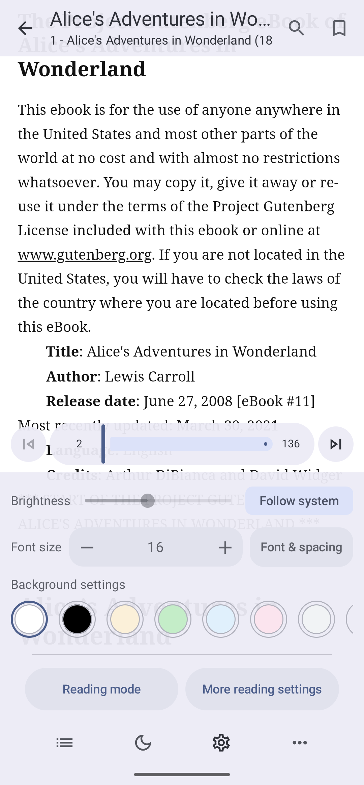
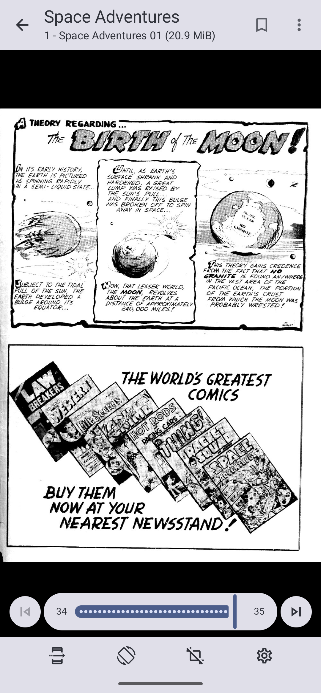
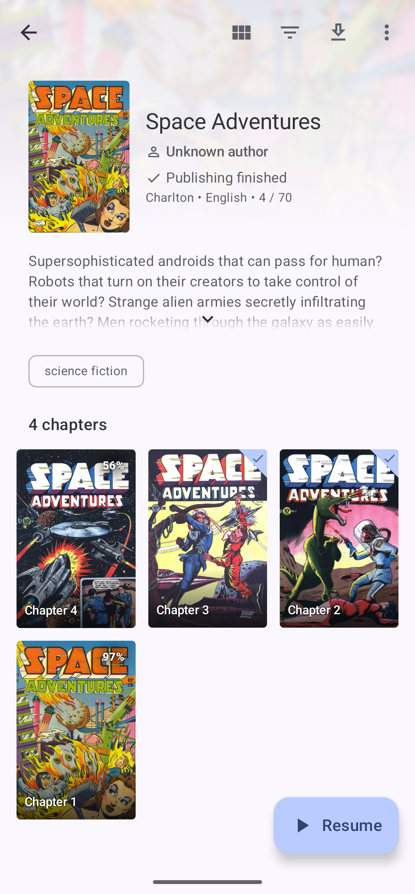
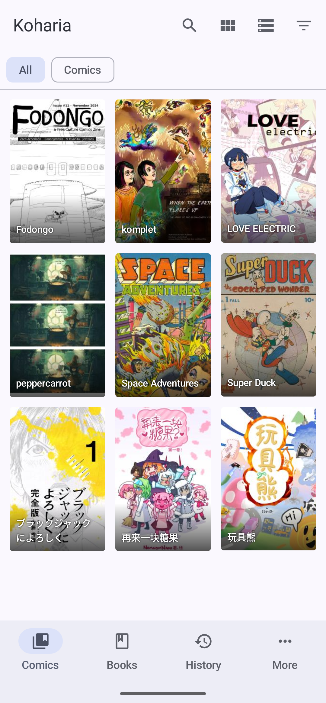

<div align="center">


<p><a href="./README.md">简体中文</a> · <strong>English</strong></p>

# Koharia

An Android comic and book reader for Komga and local media libraries

[](./LICENSE)
[](https://github.com/Mister-album/Koharia/releases/latest)

</div>

## Overview

Koharia is a third-party Android client and reader for [Komga](https://komga.org/) servers and local media libraries. It provides dedicated reading experiences for comics, scanned image content, PDFs, and reflowable books such as EPUB, TXT, and MOBI. Browsing, series details, reading progress, offline access, and reader customization are brought together in one app.

The project is built on the mature Android reading foundation of [Mihon](https://github.com/mihonapp/mihon). Koharia does not provide or host any content. What you can browse depends on the servers you connect to, your account permissions, and the local directories you explicitly grant the app access to.

<table>
  <tr>
    <td align="center" width="25%">
      <br/>
      <sub>Book reader</sub>
    </td>
    <td align="center" width="25%">
      <br/>
      <sub>Comic reader</sub>
    </td>
    <td align="center" width="25%">
      <br/>
      <sub>Series details</sub>
    </td>
    <td align="center" width="25%">
      <br/>
      <sub>Library</sub>
    </td>
  </tr>
</table>

## Who is it for?

- Readers who want comics, PDFs, and multiple ebook formats in a single Android app.
- People with a personal or family media library who need cover browsing, series details, reading history, and progress synchronization.
- Users who want to link existing folders on their device or let the app create and manage comic and book directories.
- Readers who value control over reading direction, typography, background colors, page turning, and offline access.
- Users who want manual downloads, book caching, and comic page caching to be managed separately.

Koharia focuses on reading from personal media libraries. It does not provide public online content sources and is not intended to restore the traditional extension ecosystem.

## Key features

### Unified comic and book management

- Optionally split media libraries into Comics and Books, or keep everything in a combined library.
- Cover grid and list views, search, filters, sorting, series details, reading history, and quick switching between servers.
- Komga server library classification is kept separate from local bookshelf settings, making it easier to organize content from different sources.

### Local libraries and file import

- Link existing folders through Android's system directory picker without moving or deleting their files, or let Koharia create a managed `Comics`, `Books`, and `.koharia` directory structure.
- Mark local directories as comics, books, or mixed content and assign them to custom bookshelves.
- Choose between a series-based library, where each top-level folder is treated as a series, and an individual-file library, which recursively lists files and image folders that can be opened directly.
- Local indexing, pull-to-refresh, cover extraction, format filters, entry metadata editing, and first-page cover generation.
- Open supported files from Android file pickers or share actions for temporary reading, or import them into a writable local library directory.
- Consistent format detection based on file extensions, MIME types, and file signatures, including files with missing or inaccurate extensions.
- Store metadata edits only in the app database, in adjacent `ComicInfo.xml` / `metadata.opf` sidecars, or in the library's unified `.koharia/metadata` directory.

### Supported local formats

| Content type | Extensions or form | Reader and limitations |
| --- | --- | --- |
| Comic archives | `CBZ`, `ZIP`, `CBR`, `RAR`, `7Z`, `CB7`, `TAR`, `CBT` | Comic reader with paged, continuous scrolling, and dual-page modes |
| Images and image folders | `JPG`, `JPEG`, `PNG`, `GIF`, `WEBP`, `AVIF`, `HEIF`, `HEIC`, `JXL` | Read as individual entries or organized image directories |
| EPUB | `EPUB` | Native reflowable reader with table of contents, bookmarks, search, and typography controls |
| PDF | `PDF` | Native page rendering through the paged or continuous comic reading flow |
| Plain text | `TXT` | Detects common encodings including UTF-8, UTF-16, and GB18030; supports pagination and book typography controls; 64 MiB file limit |
| Mobipocket / Kindle | `MOBI`, `PRC`, `AZW`, `AZW3` | Experimental PalmDOC / KF8 text and basic metadata support with reflowable pagination; DRM, complex layouts, and embedded images are not supported; 256 MiB file limit |
| DjVu | `DJVU`, `DJV` | Uses the MIT-licensed `djvu-rs` WASM decoder for JB2 / IW44 pages and displays them in the comic reader; requires WebAssembly support in Android WebView |

The DjVu decoder runs in the JavaScript / WebAssembly runtime provided by the system WebView. Chicory is not bundled or used by the current build. See [`app/src/main/assets/djvu/README.txt`](./app/src/main/assets/djvu/README.txt) for its source, license, and checksum.

### Comic reading

- Paged, continuous scrolling, left-to-right, right-to-left, and dual-page reading modes.
- Common controls for zooming, rotation, cropping, reading direction, chapter navigation, and progress seeking.
- Prioritizes the current page and prefetches nearby pages according to the reading direction for smoother navigation.
- Supports per-page caching and manual downloads, so cached content remains available when the network is unstable.

### EPUB book reading

- A native EPUB reading flow with paged and continuous scrolling modes in multiple directions.
- Adjustable font size, font family, line height, paragraph spacing, page margins, first-line indentation, and reading area.
- Custom background colors, brightness, publisher styles, volume-key page turning, and display cutout support.
- Table of contents, bookmarks, full-text search, chapter navigation, reading percentage, and visual page counts.
- Recalculates the current and total visual pages after layout changes, and reuses pagination results for matching device and layout settings.

### Progress, offline access, and data management

- Saves local reading positions, history, and bookmarks, and synchronizes supported reading progress with the server.
- Manual downloads, book cache, and comic page cache use separate policies; cached content is never incorrectly marked as downloaded.
- Cache size limits, on-demand resource loading, offline access, and server-specific download directories.
- Multiple server and local library connections, independent reader settings, backup and restore, and database migration from older releases.

## Download

| Channel | Download | Notes |
| --- | --- | --- |
| GitHub Releases | [Download the latest release](https://github.com/Mister-album/Koharia/releases/latest) | Recommended; includes complete release notes and APK assets |
| Quark Drive | [Open download link](https://pan.quark.cn/s/f80624cde564?pwd=8tbp) | Access code: `8tbp` |
| Baidu Netdisk | [Open download link](https://pan.baidu.com/s/1DlOuovGpIkaQh6NSo7b4cw?pwd=6s2g) | Access code: `6s2g` |

Before installing, make sure the APK was published by this project. GitHub Releases is the source of truth for version information and release notes.

## Building the project

Koharia supports Android 8.0 and later. Android Studio is recommended, but the project can also be built from Windows PowerShell with Gradle.

Common validation commands:

```powershell
.\gradlew.bat spotlessCheck
.\gradlew.bat :app:compileDebugKotlin
```

Build a release APK:

```powershell
.\gradlew.bat :app:assembleRelease
```

Release signing reads the local `keystore.properties` file. You normally do not need to configure release signing for local development or debugging.

## Origins and attribution

Koharia is based on [Mihon](https://github.com/mihonapp/mihon) and is distributed under the Apache License 2.0. License and attribution details are available in [LICENSE](./LICENSE) and [NOTICE](./NOTICE).

See [CONTRIBUTING.md](./CONTRIBUTING.md) and [CODE_OF_CONDUCT.md](./CODE_OF_CONDUCT.md) for contribution guidelines. If you redistribute Koharia or create a derivative project, retain the required attribution and do not describe it as an official Mihon or Komga release.

## Acknowledgements

Koharia builds on the original work by Javier Tomas, the continuing contributions of the Mihon community, and the server ecosystem maintained by the Komga community. Thank you to everyone who continues to improve this derivative project.

## Community and feedback

Join the [Komga Discord server](https://discord.gg/komga-678794935368941569) and visit the `Koharia` channel to discuss the app, share your reading experience, and report issues you encounter.

## Support

Koharia is an independently maintained open-source project. Ongoing maintenance requires time for upstream changes, reader improvements, downloads and synchronization, Android compatibility, testing, and releases.

If Koharia is useful to your reading workflow, you can support the project through Patreon or Afdian. Your support helps keep the project updated and makes it possible to spend more time fixing issues and improving the comic and book reading experience.

- Patreon: [https://www.patreon.com/c/ALBUM937](https://www.patreon.com/c/ALBUM937)
- Afdian: [https://ifdian.net/a/album-Koharia](https://ifdian.net/a/album-Koharia)

## Disclaimer

Koharia does not provide or host any content. The app only connects to personal media servers configured by the user and scans or imports local files the user explicitly authorizes; the local index is used solely to organize and display that content on the device. Make sure you have the right to use the content on your servers and in your local directories, and comply with the laws applicable in your region.

## License

Copyright (C) 2015 Javier Tomas

Copyright (C) Mihon contributors

Copyright (C) 2026 Koharia contributors

This project is licensed under the Apache License, Version 2.0. See [LICENSE](./LICENSE) and [NOTICE](./NOTICE) for details.
