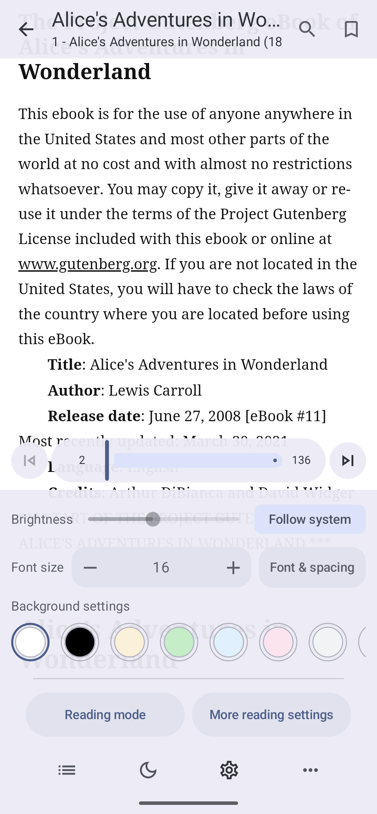
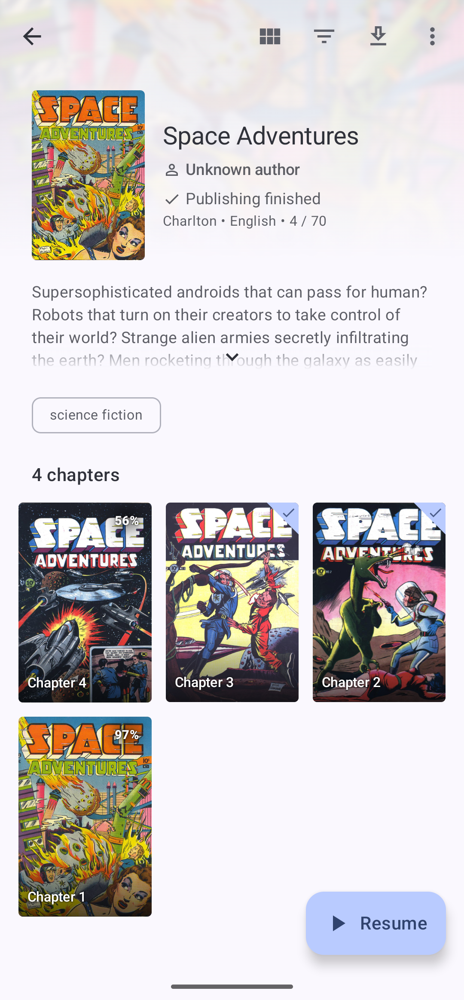
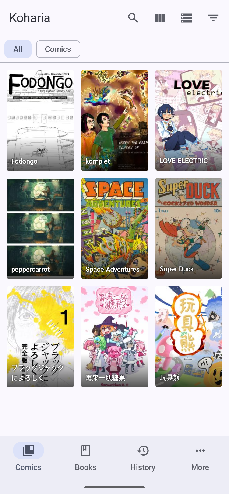

<div align="center">


<p><a href="./README.md">简体中文</a> · <strong>English</strong></p>

# Koharia

An Android comic and book reader for Komga, Kavita, LANraragi, smanga, Suwayomi, and local media libraries

[](./LICENSE)
[](https://github.com/Mister-album/Koharia/releases/latest)

</div>

## Overview

Koharia is a third-party Android client and reader for [Komga](https://komga.org/), [Kavita](https://www.kavitareader.com/), [LANraragi](https://github.com/Difegue/LANraragi), [smanga](https://github.com/lkw199711/smanga), and [Suwayomi](https://github.com/Suwayomi/Suwayomi-Server) servers, as well as local media libraries. Local libraries can use device folders or network folders over WebDAV and SMB. It provides dedicated reading experiences for comics, scanned image content, PDFs, and reflowable books such as EPUB, TXT, MOBI, and Markdown. Browsing, series details, reading progress, offline access, and reader customization are brought together in one app. Supported formats and synchronization features vary by source, as described below.

The project is built on the mature Android reading foundation of [Mihon](https://github.com/mihonapp/mihon). Koharia does not provide or host any content. What you can browse depends on the servers you connect to, your account permissions, and the local directories you explicitly grant the app access to.

<table>
  <tr>
    <td align="center" width="25%">
      <br/>
      <sub>Book reader</sub>
    </td>
    <td align="center" width="25%">
      <br/>
      <sub>Comic reader</sub>
    </td>
    <td align="center" width="25%">
      <br/>
      <sub>Series details</sub>
    </td>
    <td align="center" width="25%">
      <br/>
      <sub>Library</sub>
    </td>
  </tr>
</table>

## Who is it for?

- Readers who want comics, PDFs, and multiple ebook formats in a single Android app.
- People with a personal or family media library who need cover browsing, series details, reading history, and progress synchronization.
- Users who want to link existing folders on their device or let the app create and manage comic and book directories.
- Readers who value control over reading direction, typography, background colors, page turning, and offline access.
- Users who want manual downloads, book caching, and comic page caching to be managed separately.

Koharia focuses on reading from personal media libraries and does not bundle public online content sources. Sources and extensions in a Suwayomi connection are provided and run by your own server; Mihon extensions are not installed on the Android device.

## Key features

### Komga libraries

- Built-in Komga support with multiple server and account connections and quick switching from the shelf.
- Browse series and books by server library, view covers and metadata, and use search, filters, and sorting.
- Read comics in paged, continuous scrolling, or dual-page modes, and EPUB books in the reflowable reader.
- Online reading, manual downloads, offline access, and synchronization of supported reading progress and history with the server.
- Shelf data is cached locally and shown first; manual refresh and server update events retrieve changes.

### Kavita libraries

- Built-in integration without a Mihon extension, targeting **Kavita 0.8.0 and later**. Available features depend on the server version and account permissions.
- Multiple servers and accounts, reverse-proxy subpaths, and an optional LAN address for the same server. Account data, caches, and reading records are isolated by connection.
- Separate comics and books according to the server library type, retain series, volumes, and chapters, and browse covers, details, and search results.
- A bottom sheet separates sorting from common filters: library, format, publication status, genre, tags, collections, language, age rating, and Want to Read.
- Comics use the paged or scrolling reader; EPUB uses the native reflowable reader; PDF offers page rendering and a reflow entry point. Online EPUB reading uses the server reading API without requiring original-file download permission.
- Reading progress is saved locally before asynchronous synchronization, with history, pending offline updates, and progress conflict selection. EPUB synchronization uses content locations rather than device-dependent visual page counts.
- Access Want to Read, collections, cross-series reading lists, and Smart Filters, along with comic page bookmarks, personal table-of-contents bookmarks, and EPUB highlights and notes, subject to server version and permissions.
- Custom shelves in connection settings let you change the visibility and order of shelves on your Kavita homepage. Changes sync immediately; removing a custom shelf does not delete books or its saved filter.
- Manual downloads and explicit offline saving respect server permissions. Cached shelf metadata does not mean the content has been downloaded. Basic reading does not require Kavita+; subscription features are supplied by the server.

### LANraragi libraries

- Built-in support without extensions. Add multiple servers using a server URL and API key; leave the key empty when authentication is disabled.
- Read each Archive as an individual entry, browse Tankoubon collections and their Archive members, and switch Categories from the top of the shelf.
- Search, tag and reading-status filters, sorting, online reading, and offline reading of manual downloads.
- Open an Archive directly in the reader or show a details page with a grid of page previews, then start reading from a selected page.
- Cached library metadata remains available for offline browsing and search. Page content requires a separate download; metadata cache does not mean a book is downloaded.
- Synchronize progress per Archive and retry pending offline reading updates after reconnecting. The server must allow progress tracking and grant the required permissions. Marking an entry unread resets local state only, leaving server progress unchanged.

### smanga libraries

- Built-in support without extensions, targeting the **smanga 4.3 API**. Connect with a server URL, username, and password, with **OPDS enabled** on the server. Saving a connection validates both login and OPDS access.
- Add multiple connections, including server URLs with reverse-proxy subpaths or an `/api` suffix. An optional LAN address for the same server is preferred on Wi-Fi.
- Browse all media libraries accessible to the account or select a single library. Search by name, sort by name, update time, or creation time, and filter to downloaded content.
- View series details and chapter lists, read comic pages and PDFs, and download chapters for offline reading. PDFs require the complete original file before pages can be rendered.
- Shelf and details data are cached persistently and shown first on startup. Previously cached content remains browsable offline; uncached queries still require a connection. Catalogue caching and content downloads are managed separately.
- Synchronize chapter progress, read status, and reading history, with pending updates stored locally for retry. Progress conflicts or changes to page mapping can prompt a choice between local and server progress. Caches and reading records are isolated by connection and account.

### Suwayomi libraries

- Built-in [Suwayomi-Server](https://github.com/Suwayomi/Suwayomi-Server) integration targeting **2.4.2366 and later**. Saving a connection validates the version, authentication, and required API capabilities.
- Add multiple connections with a server URL and matching authentication mode: None, Basic, Simple Login, or UI Login / JWT. Include any reverse-proxy subpath in the URL; an optional LAN address must be verified as belonging to the same server.
- Browse the server library by category, with covers, series details, chapters, search, filters, and sorting. Choose visible categories in connection settings and manage server categories and manga assignments in the app.
- Browse, search, filter, and pin server sources, change source preferences, and install, update, or uninstall server extensions. Available sources, extensions, and actions depend on the server configuration.
- Read comics with the shared paged, scrolling, or dual-page reader and download chapters to the device for offline reading. Server download queue management is separate: downloading to the server does not save content to your phone.
- Shelf and details screens show cached data first, fetch missing data as needed, and support manual refresh. Refreshing the shelf reads existing server data separately from explicitly fetching source details and chapters.
- Reading progress, read status, and history are isolated by connection and account, with offline updates saved locally for synchronization. Progress conflicts or page mapping changes allow a choice between local and server progress.
- A source migration flow within the same server finds target manga and transfers selected information such as categories and reading state. Local download files are not directly converted into downloads for the target source.

Suwayomi integration provides comic reading without an EPUB reader entry point.

### Local media libraries

- Read local comic archives, image folders, PDFs, EPUB, TXT, MOBI, and **Markdown documents**. Markdown supports paginated book-style reading with headings, lists, blockquotes, and code blocks, plus adjustable fonts and typography.
- Link existing folders through Android's system directory picker without moving or deleting their files, or let Koharia create a managed `Comics`, `Books`, and `.koharia` directory structure.
- Connect to folders on a NAS or home server over WebDAV or SMB, using the local library's shelf organization and reader entry points. Setup and limitations are described below.
- Mark local directories as comics, books, or mixed content and assign them to custom bookshelves.
- Choose between a series-based library, where each top-level folder is treated as a series, and an individual-file library, which recursively lists files and image folders that can be opened directly.
- Local indexing, pull-to-refresh, cover extraction, format filters, entry metadata editing, and first-page cover generation.
- Open supported files from Android file pickers or share actions for temporary reading, or import them into a writable local library directory.
- Consistent format detection based on file extensions, MIME types, and file signatures, including files with missing or inaccurate extensions.
- Store metadata edits only in the app database, in adjacent `ComicInfo.xml` / `metadata.opf` sidecars, or in the library's unified `.koharia/metadata` directory.

#### Supported local formats

| Content type | Extensions or form | Reader and limitations |
| --- | --- | --- |
| Comic archives | `CBZ`, `ZIP`, `CBR`, `RAR`, `7Z`, `CB7`, `TAR`, `CBT` | Comic reader with paged, continuous scrolling, and dual-page modes |
| Images and image folders | `JPG`, `JPEG`, `PNG`, `GIF`, `WEBP`, `AVIF`, `HEIF`, `HEIC`, `JXL` | Read as individual entries or organized image directories |
| EPUB | `EPUB` | Native reflowable reader with table of contents, bookmarks, search, and typography controls |
| PDF | `PDF` | Native page rendering through the paged or continuous comic reading flow |
| Plain text | `TXT` | Detects common encodings including UTF-8, UTF-16, and GB18030; supports pagination and book typography controls; 64 MiB file limit |
| Markdown | `MD`, `MARKDOWN`, `MDOWN`, `MKD`, `MKDN` | Reflowable pagination with rich text for headings, bold, italic, lists, blockquotes, and code blocks; supports pagination and book typography controls; embedded images are not rendered and tables degrade to plain text; 16 MiB file limit |
| Mobipocket / Kindle | `MOBI`, `PRC`, `AZW`, `AZW3` | Experimental PalmDOC / KF8 text and basic metadata support with reflowable pagination; DRM, complex layouts, and embedded images are not supported; 256 MiB file limit |
| DjVu | `DJVU`, `DJV` | Uses the MIT-licensed `djvu-rs` WASM decoder for JB2 / IW44 pages and displays them in the comic reader; requires WebAssembly support in Android WebView |

The DjVu decoder runs in the JavaScript / WebAssembly runtime provided by the system WebView. Chicory is not bundled or used by the current build. See [`app/src/main/assets/djvu/README.txt`](./app/src/main/assets/djvu/README.txt) for its source, license, and checksum.

#### WebDAV / SMB network folders

Choose WebDAV or SMB when adding a local library, then name the connection, authenticate, select the library folder, and configure shelves. Each connection has a fixed storage mode and can contain multiple shelf directories. Existing local connections retain their directory grants and reading records.

- **WebDAV**: enter the server address, port, and required credentials, for example `https://example.com:5006`. After authentication, browse or enter a library path, or use the server root. Complete URLs such as `https://example.com/dav/books/` are also accepted; services such as Nextcloud can use a directory path like `remote.php/dav/files/<user>`.
- **SMB**: SMB2/SMB3 are supported. Enter the server address and port, for example `192.168.1.10:445`, along with credentials and a domain if required, then browse shares and subfolders. Complete addresses such as `smb://192.168.1.10/library` are also accepted.
- Select a different library folder in connection settings and validate again after changing connection details. The default library folder belongs to that connection and does not change global backup, download, or cache locations.
- A primary address and optional LAN address are supported. Automatic switching requires verification that both access the same root. For LAN-only use, enter the LAN address as the primary address.
- Use the local library's series-based or individual-file organization, cover browsing, details, and readers selected by format. Initial scanning exposes entries progressively; later visits show the saved index first. Refresh after external file changes; reconnecting does not automatically rescan shelves.
- Content is read on demand, with an automatic cache of **512 MiB** by default, adjustable in shared settings. Files without range-read support require complete caching first. Manual downloads are managed separately; a saved index or partial cache does not mean complete offline availability.
- Writable roots store library identity, file identity mappings, and progress records in `.koharia`. The same account can synchronize across devices, while different accounts keep separate progress. Events merge by modification time, including backward movement and unread events, so device clocks affect the result. Without writable shared identity, only one read-only address and local progress are supported.
- Restored network connections require validation. Removing a connection cleans up its local state without deleting remote files. Legacy remote progress files without account scope are retained but no longer imported automatically.

Accessing the same physical folder over WebDAV and SMB creates separate connections. Cross-protocol content version matching and progress merging are not supported.

### Unified comic and book management

- Optionally split media libraries into Comics and Books, or keep everything in a combined library.
- Cover grid and list views, search, filters, sorting, series details, reading history, and quick switching between servers.
- Accounts, library data, and reading records are isolated by connection. App appearance and reader settings are shared for a consistent experience when switching sources.

### Comic reading

- Paged, continuous scrolling, left-to-right, right-to-left, and dual-page reading modes.
- Common controls for zooming, rotation, cropping, reading direction, chapter navigation, and progress seeking.
- Prioritizes the current page and prefetches nearby pages according to the reading direction for smoother navigation.
- Supports per-page caching and manual downloads, so cached content remains available when the network is unstable.

### EPUB book reading

- A native EPUB reading flow with paged and continuous scrolling modes in multiple directions.
- Adjustable font size, font family, line height, paragraph spacing, page margins, first-line indentation, and reading area.
- Custom background colors, brightness, publisher styles, volume-key page turning, and display cutout support.
- Table of contents, bookmarks, full-text search, chapter navigation, reading percentage, and visual page counts.
- Read aloud while following sentence highlighting, with automatic continuation and controls for the speech engine, voice, and speed.
- Recalculates the current and total visual pages after layout changes, and reuses pagination results for matching device and layout settings.

#### Read-aloud (TTS)

- Reads the current EPUB chapter sentence by sentence and continues into the next chapter automatically; sentence highlighting and reading progress stay in sync, and you can skip sentences, pause, and resume from the in-reader control bar or from the lock screen / Bluetooth media keys.
- Microsoft Edge online voices are used by default, with no API key required. You can also choose Xiaomi MiMo TTS with your own API key. Voices are stored separately per engine.
- Playback controls and frequently used options are available inside the reader; full configuration is under the speech engine section of book reader settings.
- Adjustable reading speed; inter-sentence gaps and MP3 encoder delay/padding are trimmed automatically for smooth playback.
- Read-aloud holds audio focus and coexists correctly with other players: playback resumes after a short interruption such as a phone call, and volume is lowered when ducking is requested.
- Synthesized sentences are cached on device (256 MiB cap, least-recently-used eviction), so replaying a chapter does not re-synthesize it.
- **Data disclosure**: speech is synthesized by the selected engine, so **the current chapter text is uploaded to that vendor** (MiMo or Microsoft). A one-time dialog confirms this before the first listen and the settings page keeps the notice permanently visible; use another reading mode if you would rather not share chapter text.
- API keys are stored only on the device, encrypted with the Android keystore (AES-256-GCM); no plaintext key is present in build artifacts or backups.

Xiaomi MiMo TTS is **currently available for a free, limited-time trial**. You can [register on the Xiaomi MiMo Open Platform](https://platform.xiaomimimo.com?ref=RD7JZG) to try it. Create an API key, then select MiMo and enter the key in Koharia’s speech engine settings. Trial availability, quotas, and duration are subject to [Xiaomi’s official information](https://mimo.mi.com/models/en-US/mimo-v2.5-tts) and the platform’s latest terms.

### Progress, offline access, and data management

- Komga, Kavita, LANraragi, smanga, and Suwayomi shelves show existing local cache first. Missing data is fetched on demand, with manual refresh available afterward; Komga and Kavita also respond to server update events. WebDAV / SMB folders also retain a local index that can be refreshed after external file changes.
- Saves local reading positions, history, and bookmarks, and synchronizes supported reading progress with the server.
- Manual downloads, book cache, and comic page cache use separate policies; cached content is never incorrectly marked as downloaded.
- Cache size limits, on-demand resource loading, offline access, and server-specific download directories.
- Multiple server and local library connections, shared reader settings, backup and restore, and database migration from older releases.

## Download

| Channel | Download | Notes |
| --- | --- | --- |
| GitHub Releases | [Download the latest release](https://github.com/Mister-album/Koharia/releases/latest) | Recommended; includes complete release notes and APK assets |
| Quark Drive | [Open download link](https://pan.quark.cn/s/f80624cde564?pwd=8tbp) | Access code: `8tbp` |
| Baidu Netdisk | [Open download link](https://pan.baidu.com/s/1DlOuovGpIkaQh6NSo7b4cw?pwd=6s2g) | Access code: `6s2g` |

Before installing, make sure the APK was published by this project. GitHub Releases is the source of truth for version information and release notes.

## Building the project

Koharia supports Android 8.0 and later. Android Studio is recommended, but the project can also be built from Windows PowerShell with Gradle.

Common validation commands:

```powershell
.\gradlew.bat spotlessCheck
.\gradlew.bat verifyEInkMotion
.\gradlew.bat :app:compileDebugKotlin
```

For CI-aligned validation, also run unit tests and database migration checks:

```powershell
.\gradlew.bat testDebugUnitTest
.\gradlew.bat verifySqlDelightMigration
```

Build a release APK:

```powershell
.\gradlew.bat :app:assembleRelease
```

Release signing reads the local `keystore.properties` file. You normally do not need to configure release signing for local development or debugging.

## Origins and attribution

Koharia is based on [Mihon](https://github.com/mihonapp/mihon) and is distributed under the Apache License 2.0. License and attribution details are available in [LICENSE](./LICENSE) and [NOTICE](./NOTICE).

See [CONTRIBUTING.md](./CONTRIBUTING.md) and [CODE_OF_CONDUCT.md](./CODE_OF_CONDUCT.md) for contribution guidelines. If you redistribute Koharia or create a derivative project, retain the required attribution and do not describe it as an official Mihon, Komga, Kavita, LANraragi, smanga, or Suwayomi release.

## Acknowledgements

Koharia builds on the original work by Javier Tomas, the continuing contributions of the Mihon community, and the server ecosystem maintained by the Komga community. Thank you to everyone who continues to improve this derivative project.

## Community and feedback

Join the [Komga Discord server](https://discord.gg/komga-678794935368941569) and visit the `Koharia` channel to discuss the app, share your reading experience, and report issues you encounter.

## Support

Koharia is an open-source project improved by its maintainer and community contributors. Ongoing maintenance requires time for upstream changes, reader improvements, downloads and synchronization, Android compatibility, testing, and releases.

If Koharia is useful to your reading workflow, you can support the project through Patreon or Afdian. Your support helps sustain maintenance, bug fixes, and improvements to the comic and book reading experience. Code, documentation, testing, and issue reports are equally welcome ways to contribute.

- Patreon: [https://www.patreon.com/c/ALBUM937](https://www.patreon.com/c/ALBUM937)
- Afdian: [https://ifdian.net/a/album-Koharia](https://ifdian.net/a/album-Koharia)

## Disclaimer

Koharia does not provide or host any content. The app only connects to personal media servers configured by the user and scans or imports local files the user explicitly authorizes; the local index is used solely to organize and display that content on the device. Make sure you have the right to use the content on your servers and in your local directories, and comply with the laws applicable in your region.

## License

Copyright (C) 2015 Javier Tomas

Copyright (C) Mihon contributors

Copyright (C) 2026 Koharia contributors

This project is licensed under the Apache License, Version 2.0. See [LICENSE](./LICENSE) and [NOTICE](./NOTICE) for details.

## Contributors

Thank you to everyone who contributes code, documentation, translations, testing, and issue reports to Koharia. Read the [contribution guide](./CONTRIBUTING.md) to get involved.

<!-- koharia-contributors:start -->
<p>
  <a href="https://github.com/CurrenWong"></a>
  <a href="https://github.com/Mister-album"></a>
</p>
<!-- koharia-contributors:end -->

[Report an issue or suggest an improvement](https://github.com/Mister-album/Koharia/issues)
