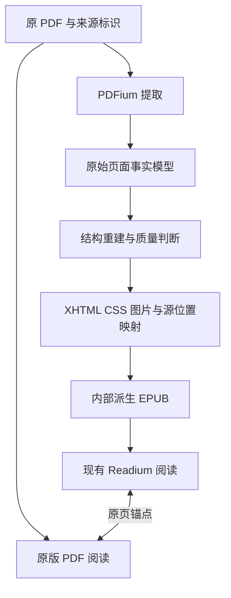

# PDFium → 派生 EPUB → Readium：建议方案

本方案结合[用户提供的完整分析](https://chatgpt.com/share/6a9c0201-8d10-83e8-b2a5-35883e8adb7a)与当前工作区源码。采纳 PDFium、宽松许可、保留原版阅读、使用 Readium 承接重排的方向；MuPDF 不纳入本轮选型。下列新增模块和字段均为建议，尚未实现或引入依赖。

## 结论与范围

正式路线采用 **PDFium 结构化提取 → 可追溯的中间模型 → 结构重建 → 带样式 XHTML → 内部派生 EPUB → 现有 Readium**。

TXT/MOBI 的 `TextDocumentSession` 可留作纯文字实验，但不作为这条图文重排链路的最终显示层。原 PDF 始终保留，派生 EPUB 是同一本书的另一种显示材料，不新增书库条目，不替换原文件，也不自动变成“手动下载”。



## 1. PDFium 选型先通过能力验证

优先评估 PdfiumAndroidKt，用项目自己的 `PdfExtractionEngine` 接口隔离第三方封装。先验证再确定版本，不直接将 README 中的依赖版本或仓库 main 当成上线版本。

| 所需信息 | PDFium 原生能力 | 接入时的检查 |
|---|---|---|
| Unicode、字符范围、位置 | 文本与字符边框接口 | 字符索引与输出 UTF-16 偏移是否一致；保留生成字符、未知 Unicode 状态 |
| 字号、字体、字重、颜色 | `FPDFText_GetFontSize/GetFontInfo/GetFontWeight/GetFillColor` 等 | 封装是否暴露；部分 API 为实验性；未知值不能冒充正常样式 |
| 旋转与文字变换 | 字符角度、矩阵、边框接口 | 统一 CropBox、旋转和坐标方向后再排序 |
| 图片、表单对象、复杂区域 | 页面对象及图片相关接口 | 蒙版、裁剪、变换、组合绘制是否正确；原始图片并不总等于页面上的视觉结果 |
| 结构标签、章节导航 | 结构树与书签相关接口 | 有无有效标签、对应字符覆盖度、目录目标是否合理 |

当前查看的 PdfTextPage 封装明确提供文字、字框和字号，不能据此推定它完整暴露字体、颜色、图片与结构树。缺少必要接口时，优先在同一 PDFium 构建上补充少量 JNI；避免为了补接口引入第二份不同版本的 PDFium，或跨引擎传递原生句柄。

首轮验证必须覆盖 arm64/x86_64、项目最低 Android 版本和 16 KB 内存页设备；记录原生库版本、包装层版本、许可证及随包第三方声明。转换按文档串行执行、逐页释放；取消协程不等于原生调用已停止，必须等调用退出后才能关闭对应句柄。

## 2. 使用两层中间数据，而不是直接从字符拼 HTML

建议将数据分为：

- **提取事实层**：页面尺寸/旋转/裁剪框、字符与 quad、字体标识、点数字号、颜色、图片/对象范围、目录和结构标签。记录来源与未知信息。
- **重排结构层**：章节、段落、样式片段、插图、脚注候选和原版区域引用，并保存规则版本、置信度及来源范围。

“字体 18 pt”是事实，“一级标题”是推断；“出现在页顶”是事实，“重复页眉”是推断。提取事实应可独立缓存，修改断行或标题规则时无需重新跑整个原生解析器。

原页统一坐标系是首要前提：不能把 PDF 的原始坐标直接当成屏幕/XHTML 坐标。跨页段落应允许对应多个原页范围；中文断行合并、西文断词、连字展开都会改变文本偏移，需同步维护映射。

## 3. 第一版生成有效、完整的 EPUB

当前 `LocalEpubPublicationService` 通过 `MediaType.EPUB`、`DefaultPublicationParser`、`EpubNavigatorFactory` 打开出版物，因此第一版优先生成标准 EPUB 包，复用已有链路。直接向导航器传 HTML，或仅放开 `.pdf` 扩展名检查，都不构成有效接入。

生成内容包括 OPF、导航、spine、XHTML、CSS、图片和源位置映射。优先依据可靠 PDF 目录拆章节；没有可靠目录时按段落组分片。避免整本书只有一个超大 XHTML，也避免强制一张 PDF 页一个 XHTML，后者会固化原分页并破坏跨页段落。

第一版完成临时包并验证后再原子发布。不要修改 Readium 正在打开的 EPUB ZIP；渐进转换或自定义 Publication 可留到后续性能阶段。

### 样式策略

- 正文作为 `1em` 基准，保留标题/注释的相对字号；整体字号交给现有 Readium 设置。
- 粗斜体、强调、缩进与段间距转换为受控 CSS 类；正文颜色跟随阅读主题，特殊强调色需要暗色主题对比检查。
- 原始字体名称作为来源信息保存。第一版不追求嵌入 PDF 子集字体，优先使用读者选择的字体和合理回退。
- 插图必须保留。对于蒙版、裁剪、矢量组合或复杂区域，优先生成该区域的原页渲染图；确认原图提取能保真后再优化。
- 原始样式差异与读者统一样式沿用现有“出版样式”开关，但需确认生成 CSS 能被现有覆写规则接管。
- XHTML/CSS 按受控模板生成，文本经 XML 转义，不导入 PDF 脚本或任意远程资源。

## 4. 阅读位置采用原 PDF 锚点，而不是派生页码

建议保存两套定位，原 PDF 定位作为跨模式和跨转换版本的依据：

```text
PdfSourceAnchor
  原文件内容指纹
  原页索引 + 页面区域
  来源字符范围/位置
  规范化正文附近的少量上下文

DerivedLocator
  派生内容修订号
  XHTML href + blockId + 文本偏移
  Readium Locator
```

源字符索引依赖提取器版本，不能单独作为永久定位；应有页面区域和上下文作为重定位后备。段落 ID 不应仅按本次生成顺序编号。

本项目需要特别处理：

- `EpubReaderViewModel` 已有 EPUB 进度和远端同步逻辑。派生 EPUB 必须明确标识其来源为 PDF，不能把临时 XHTML href、Readium position 或重排视觉页数发送给原 PDF 的远端进度接口。
- 原版与重排切换均通过原页锚点转换。远端协议仅支持原页号时，明确采用原页粒度同步，本地保留更精细位置。
- 原书阅读记录、书签和历史仍属于原来的 manga/chapter；派生包不创建新书。
- 文件或规则更新时先保留旧定位和映射，再生成新派生包；无法精确恢复时回落到已知原页并说明，不能静默跳到开头。

## 5. 派生缓存与原文件下载必须分开

建议新增专用的 `PdfReflowCacheManager`，复用现有原文件获取与可恢复传输能力，但不要把产物放进手动下载目录或直接冒充 `EpubCacheManager` 的原书完整缓存。

产物键至少包含：原文件内容指纹、提取器构建标识、中间模型版本、重建规则版本及打包/资源策略版本。URI、长度、修改时间可用于快速检查，但不应是唯一真实性标识。

字号、行距、主题等 Readium 显示设置不应触发重新提取 PDF。活动会话要固定其产物版本，关闭后再回收旧版本。现有 `EpubReaderSessionRepository` 按 chapterId 存会话，需要加入产物修订校验或等价的替换机制，避免继续使用旧映射或删除仍被读取的资源。

Komga 远程 PDF 必须通过现有下载能力取得有权限访问的原文件；页面图片不能替代 PDF 对象解析输入。只有页图或没有原文件权限时，保持原版阅读，不自动启动下载或 OCR。

## 6. 推荐的用户入口与交付顺序

入口名称使用“原版 PDF / 重排阅读”，不使用“漫画 / 小说”代替版式选择。第一阶段用户主动开启重排；质量验证充分后再为高置信度文档开放自动选择，始终允许按书覆盖结果。

| 阶段 | 交付物 | 通过条件 |
|---|---|---|
| P0 原版兜底 | 修复透明 PDF 黑屏；原版仍可正常使用 | 黑色阅读器背景下文字页可见，双页/单页均正常 |
| P1 提取能力验证 | 固定 PDFium 构建、接口清单、原始模型、文字/图片位置叠加诊断 | 当前《邻家天使》和合成样本的文字、样式字段、位置可核对；原生生命周期及 ABI 检查通过 |
| P2 首个完整重排链路 | 单栏横排小说 → XHTML/EPUB → Readium，包含插图与源位置映射 | 从首段到末段无漏字/重复，支持字号和主题，原版↔重排可定位 |
| P3 样式与鲁棒性 | 页眉页脚、章节、跨页段落、基本注释、低置信度回退 | 对照标注样本验收，转换失败不影响原版，缓存重建不丢位置 |
| 后续 | 竖排、多栏、复杂表格/公式、OCR、渐进生成 | 按独立样本逐项扩展，不强行混入第一版 |

第一版以“普通单栏横排小说、标题、基本强调、段落、插图”收敛范围。表格和复杂区域先保留原页图或原版入口，而非生成看似流畅却顺序错误的正文。

必须有内容与视觉双重验收：正文顺序、漏字/重复、插图缺失、页眉误删、主题可读性、字号实际显示、冷启动恢复、字号变化、转换取消与重建。此前系统 API 在本机 PDF 抽样提取中文成功只是输入可行性证据，不等于已验证所选 PDFium 封装或最终重排质量。

## 源码落点与资料

建议新增 `koharia/pdf/extraction/`、`reflow/`、`cache/`、`progress/` 模块边界，外部引擎只在 extraction 内可见。现有入口通过独立的 PDF 重排解析器取得派生 URI 后，再交给本地 EPUB 服务；在请求和会话中明确保留 PDF 来源和产物修订信息。

已核对的当前源码：

- `app/src/main/java/koharia/epub/EpubReaderLauncher.kt`
- `app/src/main/java/koharia/epub/service/EpubReaderSupportResolver.kt`
- `app/src/main/java/koharia/epub/service/LocalEpubPublicationService.kt`
- `app/src/main/java/koharia/epub/model/EpubOpenRequest.kt`
- `app/src/main/java/koharia/epub/EpubReaderViewModel.kt`
- `app/src/main/java/koharia/epub/session/EpubReaderSessionRepository.kt`

官方资料：[PDFium 文字接口](https://pdfium.googlesource.com/pdfium/+/refs/heads/main/public/fpdf_text.h)、[页面与图像对象接口](https://pdfium.googlesource.com/pdfium/+/refs/heads/main/public/fpdf_edit.h)、[结构树接口](https://pdfium.googlesource.com/pdfium/+/refs/heads/main/public/fpdf_structtree.h)、[PdfiumAndroidKt](https://github.com/johngray1965/PdfiumAndroidKt)、[封装与 PDFium 许可证](https://github.com/johngray1965/PdfiumAndroidKt/blob/main/LICENSE)。这些资料用于核对能力，以上架构与分期是针对本项目的工程建议，不是库已提供的现成功能。
